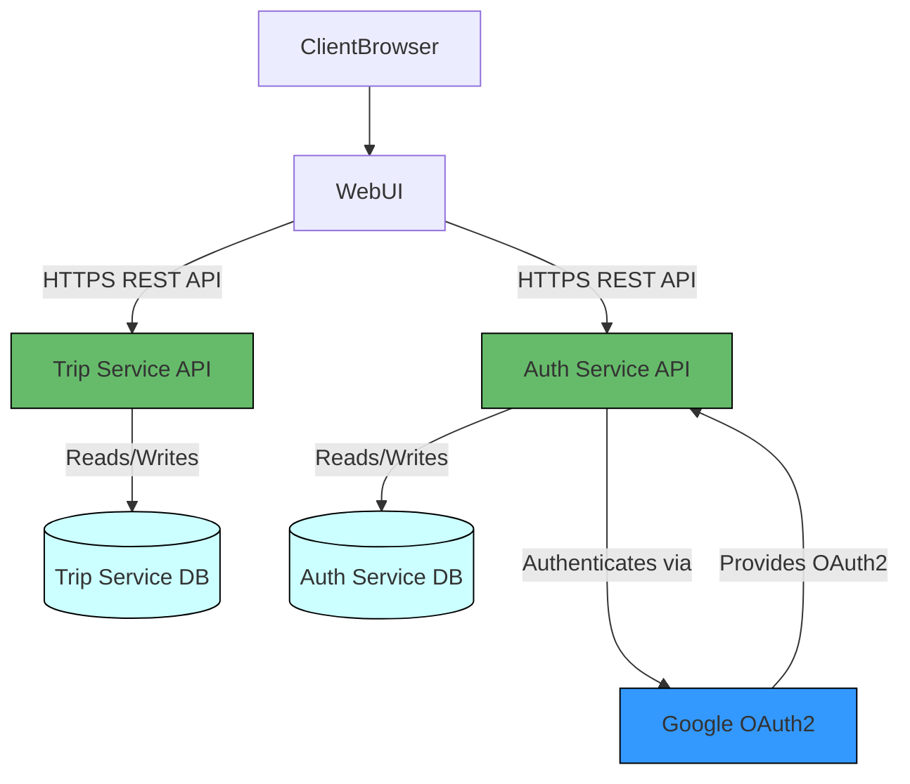
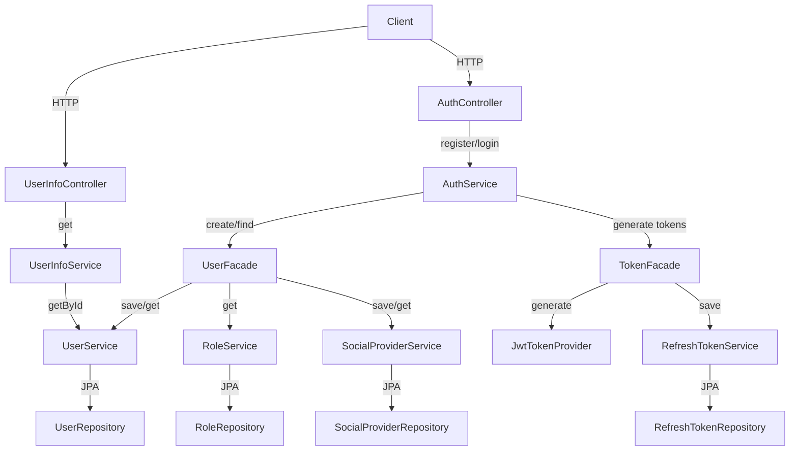
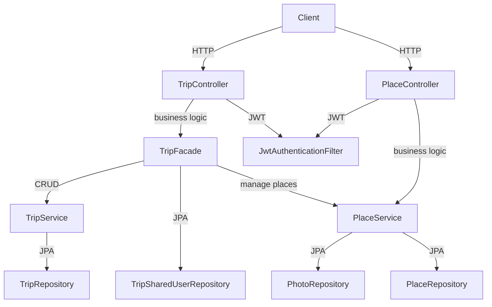
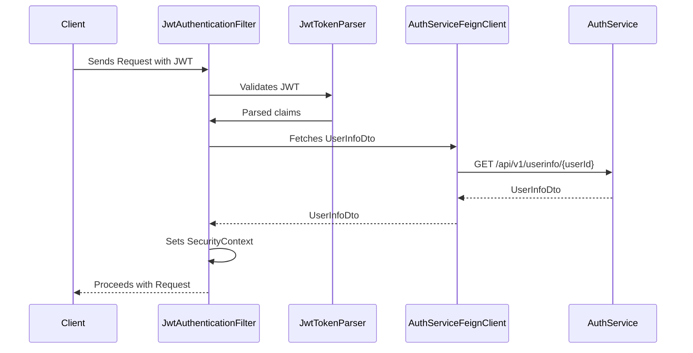
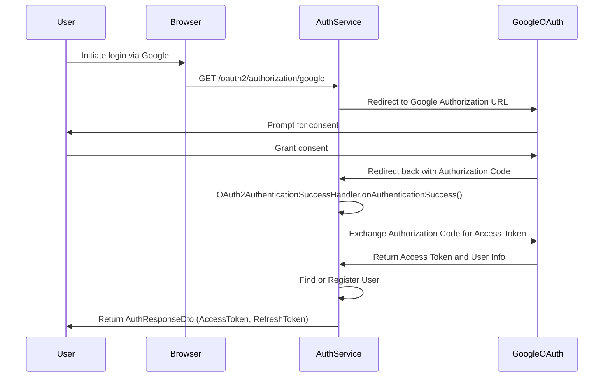

# Chronology

## Project Description

The Chronology project is a microservices-based application that allows users to register, authenticate, plan trips, and store visited places. Users can also share trips with others, edit trip details, and delete planned trips.

## Technologies Used

- Java 21
- Spring Boot 3.3.x
- Spring Security
- Spring Data JPA
- PostgreSQL
- Liquibase
- Maven
- Docker
- Testcontainers
- OpenFeign
- OpenAPI (Swagger)
- JWT (JSON Web Tokens)
- Apache Commons
- Lombok
- MapStruct

## Project Structure

The project is organized into several modules:

- **auth-service**: Handles user authentication and authorization, including registration via email/password or Google OAuth2. Provides JWT tokens for authenticated sessions.

- **trip-service**: Manages all functionalities related to trips and places, such as adding, editing, and deleting trips and places. It also handles sharing trips with other users and managing photos associated with places.

- **common-libs**: Contains common DTOs, utility classes, and constants shared across services.

- **jwt-auth-starter**: Provides JWT authentication components, filters, and interceptors. It handles authorization in trip-service and other services by interacting with auth-service via Feign clients.

- **logger-starter**: Offers aspect-oriented logging for all `@Service` and `@Repository` components, aiding in debugging and monitoring.

- **exception-handler-starter**: Provides global exception handling, a common error response structure, and a set of generic errors that can be used in other services.

## Setup and Installation

### Prerequisites

- **Docker** and **Docker Compose** installed on your machine.
- **Java 21** installed if you wish to build the project locally.

### Environment Variables

Create a `.env` file in the root directory with the following content:

```dotenv
# Google OAuth2 credentials
GOOGLE_CLIENT_ID=your_google_client_id
GOOGLE_CLIENT_SECRET=your_google_client_secret

# JWT secrets
JWT_SECRET=your_jwt_secret_key_base64_encoded
```

## Accessing the Services

- **auth-service**: Accessible at http://localhost:8081
- **trip-service**: Accessible at http://localhost:8082

## API Documentation

Swagger UI is available for both services:

- **auth-service** Swagger UI: http://localhost:8081/swagger-ui/index.html
- **trip-service** Swagger UI: http://localhost:8082/swagger-ui/index.html

## Authentication with Google OAuth2

Open this link in browser in order to authenticate with Google:
```
http://localhost:8081/oauth2/authorization/google
```

## Postman collection

[Postman collection V2.1](postman_collection.json)

## Diagrams

#### Architecture Diagram



#### Component Diagram - auth-service



#### Component Diagram - trip-service



#### Component Diagram - JWT Authentication via jwt-auth-starter


#### Component Diagram - Google OAuth2 flow
